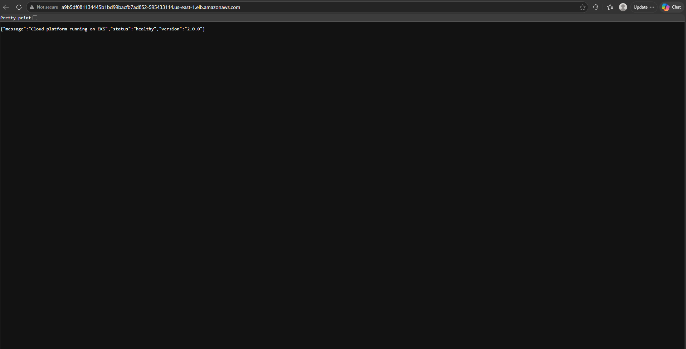

# Production-Grade Cloud Platform

A secure, scalable web application platform built on AWS using Terraform, EKS, and GitHub Actions — designed to production standards.

## Live demo



> Infrastructure is currently torn down to avoid AWS costs (~$7/day).
> To redeploy, see the deploy instructions below — full stack is back up in ~15 minutes.

## Architecture overview

```
Internet → IGW → ALB (public subnets) → EKS pods (private subnets)
GitHub push → GitHub Actions → tfsec scan → Docker build → ECR push → kubectl rolling deploy
```

## What's built

- **VPC** — Custom VPC with public/private subnets across 2 availability zones (us-east-1a, us-east-1b)
- **EKS** — Managed Kubernetes cluster with auto-scaling node group (1-4 x t3.medium) in private subnets
- **ALB** — Application load balancer in public subnets routing traffic to 3 pods
- **ECR** — Private container registry with automatic image scanning on every push
- **CI/CD** — GitHub Actions pipeline: tfsec scan → Docker build → ECR push → rolling deploy to EKS
- **Observability** — CloudWatch dashboards, CPU >80% alarm, HTTP 5xx error alarm, SNS email alerts
- **Security** — AWS Secrets Manager, encrypted S3 Terraform state, DynamoDB state locking, least-privilege IAM, tfsec scanning in CI

## Tech stack

| Layer | Technology |
|---|---|
| Infrastructure as Code | Terraform |
| Cloud provider | AWS |
| Container orchestration | Kubernetes (EKS) |
| Container registry | Amazon ECR |
| CI/CD | GitHub Actions |
| App runtime | Python / Flask / Gunicorn |
| Observability | CloudWatch, SNS |
| Security scanning | tfsec |

## Architecture decisions

**Why two NAT gateways?**
One per availability zone. A single NAT gateway is a single point of failure — if that AZ goes down, all private subnets lose internet access. Two gateways ensures high availability at the network layer.

**Why private subnets for EKS nodes?**
EKS worker nodes should never be directly accessible from the internet. All inbound traffic routes through the ALB, which only forwards to port 8080 on the app security group. Nodes have no public IPs.

**Why DynamoDB for Terraform state locking?**
Prevents concurrent terraform apply runs from corrupting the state file. If two pipeline runs trigger simultaneously, the second waits until the first releases the lock.

**Why tfsec in the CI pipeline?**
Catches infrastructure security misconfigurations before they reach AWS. Running it on every push means security is checked continuously, not as an afterthought.

**Why ECR lifecycle policy?**
Automatically expires old images keeping only the last 5. Prevents unbounded storage costs and keeps the registry clean without manual intervention.

## Infrastructure cost estimate

| Resource | Cost |
|---|---|
| EKS control plane | ~$0.10/hr |
| 2x t3.medium nodes | ~$0.09/hr |
| 2x NAT gateways | ~$0.09/hr |
| ALB | ~$0.02/hr |
| **Total** | **~$0.30/hr (~$7/day)** |

## Project structure

```
cloud-platform/
  app/                    # Flask application + Dockerfile
  k8s/                    # Kubernetes manifests
  terraform/
    modules/
      vpc/                # VPC, subnets, NAT gateways, route tables
      security/           # Security groups
      eks/                # EKS cluster + node group + IAM roles
      ecr/                # Container registry + lifecycle policy
      secrets/            # AWS Secrets Manager
      observability/      # CloudWatch dashboards + alarms + SNS
  .github/workflows/      # GitHub Actions CI/CD pipeline
```

## How to deploy

```bash
# 1. Provision infrastructure
cd terraform
terraform init
terraform apply

# 2. Configure kubectl
aws eks update-kubeconfig --region us-east-1 --name cloud-platform-cluster

# 3. Deploy app
kubectl apply -f k8s/

# 4. Tear down when done
terraform destroy
```

## CI/CD pipeline

Every push to `main` automatically:
1. Runs tfsec security scan on Terraform code
2. Builds Docker image tagged with git SHA
3. Pushes image to ECR
4. Updates EKS deployment with zero-downtime rolling update
5. Verifies rollout completes successfully